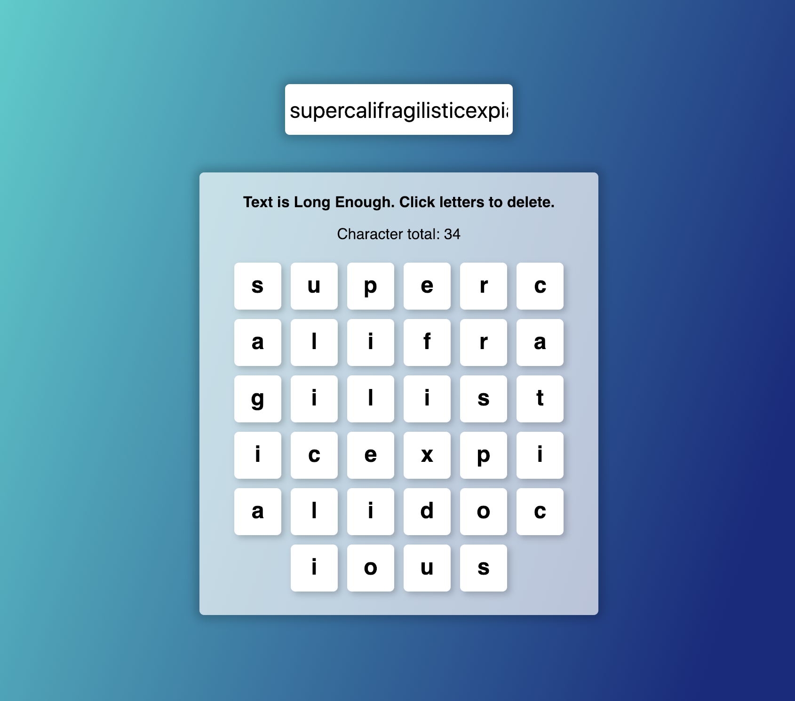

How to use the downloaded files

1) Run "npm install" in the extracted folder
2) Run "npm start" to view the project

Exercise:

1) Create an input field (in App component) with a change listener which outputs the length of the entered text below it (e.g. in a paragraph).

2) Create a new component (=> ValidationComponent) which receives the text length as a prop

3) Inside the ValidationComponent, either output "Text too short" or "Text long enough" depending on the text length (e.g. take 5 as a minimum length)

4) Create another component (=> CharComponent) and style it as an inline box (=> display: inline-block, padding: 16px, text-align: center, margin: 16px, border: 1px solid black).

5) Render a list of CharComponents where each CharComponent receives a different letter of the entered text (in the initial input field) as a prop.

6) When you click a CharComponent, it should be removed from the entered text.

This project was bootstrapped with [Create React App](https://github.com/facebookincubator/create-react-app).
